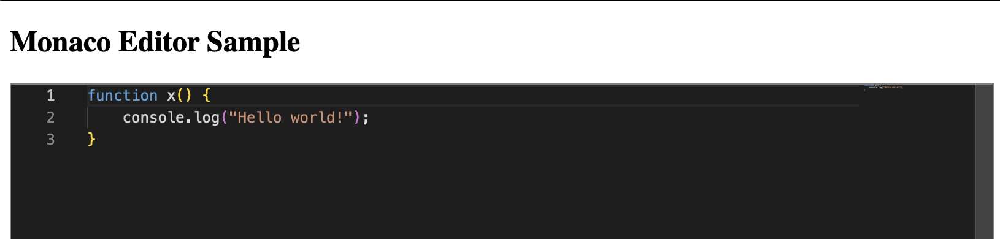
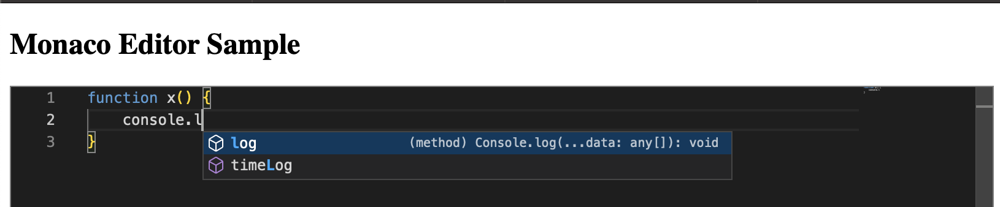

# Monaco Example

- [website](https://microsoft.github.io/monaco-editor/)
- [repo](https://github.com/microsoft/monaco-editor)

`npm install monaco-editor@0.36.1`

open [index.html](src/index.html)

## Example

## Languages

- `javascript` - works
- `csharp` - intellisense issue??

## Themes

- `"vs"`
- `"vs-dark"`
- `"hc-black"`

Links

- [MonacoEditor.tsx](https://github.com/microsoft/monaco-editor/blob/main/website/src/website/components/monaco/MonacoEditor.tsx)
- [Home.tsx](https://github.com/microsoft/monaco-editor/blob/main/website/src/website/pages/home/Home.tsx)
